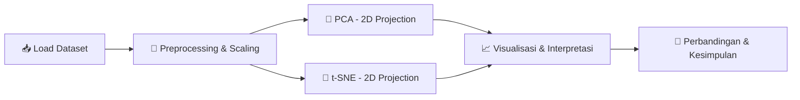

<div align="center">

# 🧬 Dimensionality Reduction: PCA & t-SNE
### Customer Segmentation Analysis pada Data E-Commerce

*Mereduksi 11 dimensi perilaku pelanggan menjadi insight yang bisa dilihat mata* 👁️

[](https://www.python.org/)
[](https://jupyter.org/)
[](https://colab.research.google.com/)
[](https://scikit-learn.org/)
[](https://pandas.pydata.org/)
[](#-lisensi)

</div>

---

## 📌 Ringkasan Proyek

Proyek ini adalah tugas praktik **Dimensionality Reduction** yang menganalisis data perilaku **1.200 pelanggan e-commerce** menggunakan dua teknik reduksi dimensi paling populer di industri:

| Teknik | Jenis | Tujuan |
|:------:|:-----:|:-------|
| 🔷 **PCA** *(Principal Component Analysis)* | Linear | Menangkap variansi global & korelasi antar fitur |
| 🔶 **t-SNE** *(t-Distributed Stochastic Neighbor Embedding)* | Non-linear | Menjaga struktur lokal & mempertegas batas cluster |

**Kasus penggunaan:** 🛍️ *Customer Segmentation* — mengidentifikasi apakah pelanggan membentuk kelompok perilaku yang berbeda (Budget Shopper, Premium Loyal, Occasional Buyer, Young Trendy) tanpa harus melihat 11 fitur sekaligus.

---

## 🎯 Hasil Kunci

> 💡 **PCA** berhasil merangkum **~58.86%** variansi data hanya dengan 2 komponen utama, dan sudah cukup untuk memisahkan segmen *Premium Loyal* dari yang lain.
>
> 🚀 **t-SNE** memberikan pemisahan cluster yang jauh lebih tegas & rapat, memvalidasi bahwa ke-4 segmen pelanggan memang punya struktur perilaku yang konsisten — cocok banget untuk algoritma clustering lanjutan seperti K-Means.

<div align="center">

| Aspek | PCA | t-SNE |
|:--|:--:|:--:|
| 🧮 Sifat proyeksi | Linear | Non-linear |
| 🌐 Fokus | Variansi global | Kedekatan lokal |
| 🔍 Kejelasan batas cluster | Cukup jelas, ada overlap tipis | Sangat tegas, minim overlap |
| ⚡ Kecepatan komputasi | Cepat | Lebih lambat |
| 🏆 Rekomendasi untuk eksplorasi visual | — | ✅ Lebih unggul |

</div>

---

## 🗂️ Struktur Proyek

```
📦 dimensionality-reduction-pca-tsne
├── 📓 Dimensionality_Reduction_PCA_tSNE.ipynb   # Notebook utama (Colab-ready)
├── 📊 ecommerce_customer_behavior.csv            # Dataset (1.200 baris, 16 kolom)
└── 📄 README.md                                  # Dokumentasi proyek ini
```

---

## 📊 Tentang Dataset

**`ecommerce_customer_behavior.csv`** berisi data sintetis yang menyerupai kondisi nyata platform e-commerce di Indonesia.

<details>
<summary>📋 <b>Klik untuk lihat detail kolom</b></summary>

| Kolom | Deskripsi |
|:--|:--|
| `customer_id` | ID unik pelanggan |
| `age` | Usia pelanggan |
| `gender` | Jenis kelamin |
| `city_tier` | Klasifikasi kota domisili |
| `monthly_income_juta` | Estimasi pendapatan bulanan (juta rupiah) |
| `monthly_spending_juta` | Total belanja bulanan (juta rupiah) |
| `purchase_frequency_per_month` | Frekuensi transaksi per bulan |
| `avg_order_value_juta` | Rata-rata nilai transaksi |
| `time_on_app_minutes_per_week` | Waktu aktif di aplikasi per minggu |
| `num_devices_registered` | Jumlah perangkat terdaftar |
| `satisfaction_score` | Skor kepuasan (1–5) |
| `days_since_last_order` | Hari sejak transaksi terakhir |
| `cashback_used_ribu` | Cashback terpakai (ribu rupiah) |
| `num_complaints_last_6m` | Jumlah komplain 6 bulan terakhir |
| `preferred_category` | Kategori belanja favorit |
| `true_segment` | Label segmen (ground truth untuk validasi visual) |

</details>

---

## 🧭 Alur Analisis



**Isi notebook:**

- ✅ **Nomor 1** — Menentukan kasus penggunaan dimensionality reduction
- ✅ **Nomor 2** — Penjelasan masalah & alasan kebutuhan reduksi dimensi
- ✅ **Nomor 3** — Implementasi PCA (2D) + visualisasi + interpretasi
- ✅ **Nomor 4** — Implementasi t-SNE (2D) + visualisasi + interpretasi
- ✅ **Nomor 5** — Analisis perbandingan PCA vs t-SNE & rekomendasi metode

---

## 🚀 Cara Menjalankan

### Opsi 1 — Google Colab *(disarankan)* ☁️

1. Buka [Google Colab](https://colab.research.google.com/)
2. `File` → `Upload notebook` → pilih `Dimensionality_Reduction_PCA_tSNE.ipynb`
3. Upload `ecommerce_customer_behavior.csv` ke sesi (ikon 📁 di sidebar kiri)
4. `Runtime` → `Run all` ▶️

### Opsi 2 — Jupyter Lokal 💻

```bash
# Clone repository
git clone <url-repo-kelompok-lu>
cd dimensionality-reduction-pca-tsne

# Install dependencies
pip install pandas numpy matplotlib seaborn scikit-learn

# Jalankan notebook
jupyter notebook Dimensionality_Reduction_PCA_tSNE.ipynb
```

---

## 🛠️ Tech Stack

<div align="center">


</div>

---

## 👥 Kelompok

| Nama | NIM | Peran |
|:--|:--:|:--|
| _(isi nama)_ | _(isi NIM)_ | _(isi peran)_ |
| _(isi nama)_ | _(isi NIM)_ | _(isi peran)_ |

> 📝 *Tugas ini merupakan bagian dari mata kuliah proyek akhir — bukti kehadiran pertemuan ke-25.*

---

## 📄 Lisensi

Proyek ini dibuat untuk keperluan akademik. Bebas digunakan sebagai referensi pembelajaran dengan mencantumkan atribusi. 🎓

<div align="center">

**⭐ Kalau proyek ini membantu, jangan lupa kasih star ya! ⭐**

</div>
