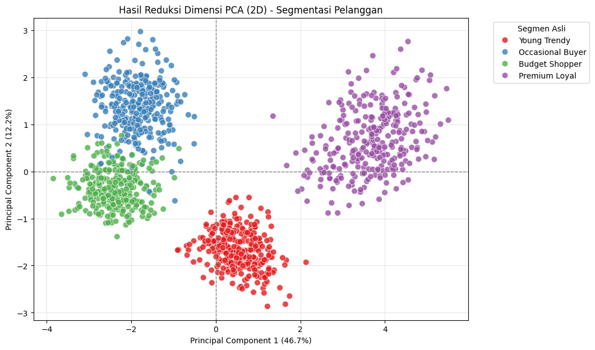
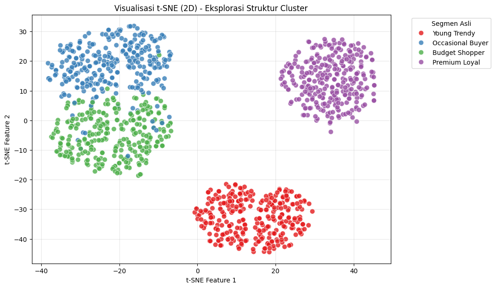
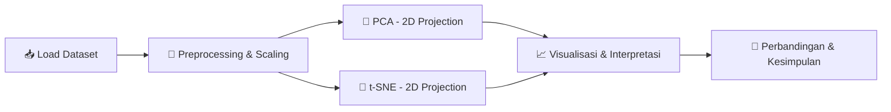

<div align="center">

# 🧬 Dimensionality Reduction: PCA & t-SNE
### Customer Segmentation Analysis pada Data E-Commerce

*Mereduksi 11 dimensi perilaku pelanggan menjadi insight yang bisa dilihat mata* 👁️

[](https://www.python.org/)
[](https://jupyter.org/)
[](https://colab.research.google.com/)
[](https://scikit-learn.org/)
[](https://pandas.pydata.org/)
[](#-lisensi)

</div>

---

## 📌 Ringkasan Proyek

Proyek ini adalah tugas praktik **Dimensionality Reduction** yang menganalisis data perilaku **1.200 pelanggan e-commerce** menggunakan dua teknik reduksi dimensi paling populer di industri:

| Teknik | Jenis | Tujuan |
|:------:|:-----:|:-------|
| 🔷 **PCA** *(Principal Component Analysis)* | Linear | Menangkap variansi global & korelasi antar fitur |
| 🔶 **t-SNE** *(t-Distributed Stochastic Neighbor Embedding)* | Non-linear | Menjaga struktur lokal & mempertegas batas cluster |

**Kasus penggunaan:** 🛍️ *Customer Segmentation* — mengidentifikasi apakah pelanggan membentuk kelompok perilaku yang berbeda (Budget Shopper, Premium Loyal, Occasional Buyer, Young Trendy) tanpa harus melihat 11 fitur sekaligus.

---

## 🎯 Hasil Kunci

> 💡 **PCA** berhasil merangkum **~58.86%** variansi data hanya dengan 2 komponen utama, dan sudah cukup untuk memisahkan segmen *Premium Loyal* dari yang lain.
>
> 🚀 **t-SNE** memberikan pemisahan cluster yang jauh lebih tegas & rapat, memvalidasi bahwa ke-4 segmen pelanggan memang punya struktur perilaku yang konsisten — cocok banget untuk algoritma clustering lanjutan seperti K-Means.

<div align="center">

| Aspek | PCA | t-SNE |
|:--|:--:|:--:|
| 🧮 Sifat proyeksi | Linear | Non-linear |
| 🌐 Fokus | Variansi global | Kedekatan lokal |
| 🔍 Kejelasan batas cluster | Cukup jelas, ada overlap tipis | Sangat tegas, minim overlap |
| ⚡ Kecepatan komputasi | Cepat | Lebih lambat |
| 🏆 Rekomendasi untuk eksplorasi visual | — | ✅ Lebih unggul |

</div>

---

## 🖼️ Visualisasi Hasil

### 🔷 PCA — Proyeksi 2 Komponen Utama

<div align="center">

</div>

Sumbu **PC1** dan **PC2** masing-masing merepresentasikan kombinasi linear dari 11 fitur asli yang menangkap arah variansi terbesar dalam data. Segmen *Premium Loyal* terlihat terpisah cukup jauh di sisi kanan grafik, sementara tiga segmen lainnya masih saling berdekatan dengan sedikit tumpang tindih di area perbatasan.

### 🔶 t-SNE — Proyeksi Non-Linear 2D

<div align="center">

</div>

Berbeda dengan PCA, t-SNE menampilkan keempat segmen sebagai kelompok-kelompok terpisah yang jauh lebih rapat dan terisolasi satu sama lain, karena algoritma ini secara khusus mengoptimalkan kedekatan antar tetangga lokal alih-alih variansi global.

---

## 🗂️ Struktur Proyek

```
📦 dimensionality-reduction-pca-tsne
├── 📓 Dimensionality_Reduction_PCA_tSNE.ipynb   # Notebook utama (Colab-ready)
├── 📊 ecommerce_customer_behavior.csv            # Dataset (1.200 baris, 16 kolom)
└── 📄 README.md                                  # Dokumentasi proyek ini
```

---

## 📊 Tentang Dataset

**`ecommerce_customer_behavior.csv`** berisi data sintetis yang menyerupai kondisi nyata platform e-commerce di Indonesia.

<details>
<summary>📋 <b>Klik untuk lihat detail kolom</b></summary>

| Kolom | Deskripsi |
|:--|:--|
| `customer_id` | ID unik pelanggan |
| `age` | Usia pelanggan |
| `gender` | Jenis kelamin |
| `city_tier` | Klasifikasi kota domisili |
| `monthly_income_juta` | Estimasi pendapatan bulanan (juta rupiah) |
| `monthly_spending_juta` | Total belanja bulanan (juta rupiah) |
| `purchase_frequency_per_month` | Frekuensi transaksi per bulan |
| `avg_order_value_juta` | Rata-rata nilai transaksi |
| `time_on_app_minutes_per_week` | Waktu aktif di aplikasi per minggu |
| `num_devices_registered` | Jumlah perangkat terdaftar |
| `satisfaction_score` | Skor kepuasan (1–5) |
| `days_since_last_order` | Hari sejak transaksi terakhir |
| `cashback_used_ribu` | Cashback terpakai (ribu rupiah) |
| `num_complaints_last_6m` | Jumlah komplain 6 bulan terakhir |
| `preferred_category` | Kategori belanja favorit |
| `true_segment` | Label segmen (ground truth untuk validasi visual) |

</details>

---

## 🧭 Alur Analisis



**Isi notebook:**

- ✅ **Nomor 1** — Menentukan kasus penggunaan dimensionality reduction
- ✅ **Nomor 2** — Penjelasan masalah & alasan kebutuhan reduksi dimensi
- ✅ **Nomor 3** — Implementasi PCA (2D) + visualisasi + interpretasi
- ✅ **Nomor 4** — Implementasi t-SNE (2D) + visualisasi + interpretasi
- ✅ **Nomor 5** — Analisis perbandingan PCA vs t-SNE & rekomendasi metode

---

## 📝 Analisis Hasil

### Masalah yang Melatarbelakangi Analisis Ini

Sebuah platform e-commerce pada dasarnya menyimpan jejak digital yang sangat kaya dari setiap penggunanya: seberapa sering mereka bertransaksi, berapa besar nilai belanja rata-rata, seberapa aktif mereka membuka aplikasi, hingga seberapa puas mereka dengan layanan yang diterima. Kekayaan data ini di satu sisi adalah aset, namun di sisi lain menjadi tantangan tersendiri bagi tim pemasaran. Dengan lebih dari sepuluh variabel yang saling tumpang tindih secara informasi, hampir mustahil bagi manusia untuk menyimpulkan pola perilaku pelanggan hanya dengan membaca tabel angka. Pertanyaan mendasar seperti *apakah pelanggan kita benar-benar terbagi ke dalam beberapa tipe yang berbeda* menjadi sulit dijawab tanpa alat bantu visual yang tepat. Di sinilah dimensionality reduction — dalam hal ini PCA dan t-SNE — berperan sebagai jembatan antara data berdimensi tinggi dan pemahaman manusia yang terbatas pada ruang dua atau tiga dimensi.

### Menyiapkan Data Sebelum Reduksi Dimensi

Sebelas fitur numerik dipilih sebagai dasar analisis, mulai dari usia dan pendapatan bulanan, hingga metrik keterlibatan seperti waktu penggunaan aplikasi dan jumlah komplain. Karena PCA dan t-SNE sama-sama sensitif terhadap skala data — sebuah fitur dengan rentang nilai besar seperti pendapatan bisa saja mendominasi fitur lain seperti skor kepuasan yang hanya berkisar satu sampai lima — seluruh fitur terlebih dahulu distandardisasi sehingga memiliki rata-rata nol dan simpangan baku satu. Langkah ini krusial agar kedua algoritma benar-benar membandingkan pola perilaku, bukan sekadar perbedaan satuan pengukuran.

### Apa yang Ditunjukkan oleh PCA

Setelah proyeksi ke dua komponen utama, PCA mampu mempertahankan sekitar **58,86%** dari total informasi yang terkandung dalam sebelas fitur asli — sebuah pencapaian yang cukup baik mengingat besarnya reduksi yang dilakukan, dari sebelas dimensi menjadi hanya dua. Pada bidang dua dimensi ini, komponen pertama (PC1) tampak paling berperan dalam memisahkan segmen *Premium Loyal* dari kelompok pelanggan lainnya, yang mengindikasikan bahwa PC1 banyak dipengaruhi oleh fitur-fitur terkait kemampuan finansial seperti pendapatan dan pengeluaran bulanan. Sementara itu, komponen kedua (PC2) berkontribusi memisahkan pelanggan *Occasional Buyer* dari *Young Trendy*, yang kemungkinan besar berkaitan dengan perbedaan usia dan frekuensi belanja di antara kedua kelompok tersebut. Meski keempat segmen sudah mulai terlihat pada plot PCA, batas antar beberapa kelompok masih tampak berhimpitan, terutama di antara pelanggan dengan karakteristik finansial yang mirip.

### Apa yang Ditunjukkan oleh t-SNE

Ketika data yang sama diproyeksikan menggunakan t-SNE, hasilnya jauh lebih tegas. Keempat segmen pelanggan tampil sebagai kelompok-kelompok terpisah yang rapat secara internal namun berjarak jauh satu sama lain. Karakteristik ini muncul karena t-SNE, berbeda dengan PCA, tidak berusaha mempertahankan variansi global melainkan berfokus menjaga kedekatan lokal — titik data yang mirip di ruang berdimensi tinggi akan tetap saling berdekatan setelah diproyeksikan ke dua dimensi. Hasilnya, pola pengelompokan yang di PCA masih sedikit kabur, di t-SNE menjadi begitu jelas sehingga dapat dikenali hanya dengan sekali pandang. Kesesuaian visual ini dengan label segmen yang sebenarnya (`true_segment`) turut memperkuat validitas bahwa keempat kelompok pelanggan memang memiliki pola perilaku yang secara konsisten berbeda satu sama lain.

### Membandingkan Kedua Pendekatan

PCA dan t-SNE pada dasarnya menjawab pertanyaan yang berbeda meski sama-sama mereduksi dimensi. PCA menjelaskan *seberapa besar penyebaran data secara keseluruhan* dan komponen mana yang paling banyak menyumbang variansi tersebut, sehingga cocok digunakan ketika interpretabilitas matematis dan kecepatan komputasi menjadi prioritas — misalnya sebagai tahap reduksi fitur sebelum data dimasukkan ke model machine learning lain. Di sisi lain, t-SNE lebih unggul ketika tujuan utamanya adalah eksplorasi visual untuk mengenali pola pengelompokan, karena kemampuannya menonjolkan struktur lokal membuat batas antar kelompok jauh lebih mudah dikenali oleh mata manusia, meski dengan konsekuensi waktu komputasi yang lebih lama dan hasil yang tidak selalu bisa diinterpretasikan secara linear seperti PCA.

### Kesimpulan

Untuk kasus penggunaan customer segmentation pada dataset ini, **t-SNE terbukti menjadi alat eksplorasi visual yang lebih unggul dibandingkan PCA**. Pemisahan kelompok yang dihasilkan jauh lebih meyakinkan dan konsisten dengan label segmen yang sebenarnya, memberi keyakinan tinggi bahwa keempat tipe pelanggan — Budget Shopper, Premium Loyal, Occasional Buyer, dan Young Trendy — benar-benar memiliki karakteristik perilaku yang berbeda secara terukur. Temuan ini membuka jalan bagi tahap analisis selanjutnya, misalnya penerapan algoritma clustering seperti K-Means untuk mengelompokkan pelanggan secara otomatis, atau penggunaan PCA sebagai tahap reduksi fitur sebelum membangun model prediktif seperti prediksi churn atau rekomendasi produk yang lebih personal.

---

## 🚀 Cara Menjalankan

### Opsi 1 — Google Colab *(disarankan)* ☁️

1. Buka [Google Colab](https://colab.research.google.com/)
2. `File` → `Upload notebook` → pilih `Dimensionality_Reduction_PCA_tSNE.ipynb`
3. Upload `ecommerce_customer_behavior.csv` ke sesi (ikon 📁 di sidebar kiri)
4. `Runtime` → `Run all` ▶️

### Opsi 2 — Jupyter Lokal 💻

```bash
# Clone repository
git clone <url-repo-kelompok-lu>
cd dimensionality-reduction-pca-tsne

# Install dependencies
pip install pandas numpy matplotlib seaborn scikit-learn

# Jalankan notebook
jupyter notebook Dimensionality_Reduction_PCA_tSNE.ipynb
```

---

## 🛠️ Tech Stack

<div align="center">


</div>

---

## 👥 Kelompok

| Nama | NIM | Peran |
|:--|:--:|:--|
| _Muhammad Rifki Apreliant_ | _24523097_ |
| _orian Edsel Devanindra_ | _24523149_ |

> 📝 *Tugas ini merupakan bagian dari mata kuliah proyek akhir — bukti kehadiran pertemuan ke-25.*

---

## 📄 Lisensi

Proyek ini dibuat untuk keperluan akademik. Bebas digunakan sebagai referensi pembelajaran dengan mencantumkan atribusi. 🎓

<div align="center">

**⭐ Kalau proyek ini membantu, jangan lupa kasih star ya! ⭐**

</div>
